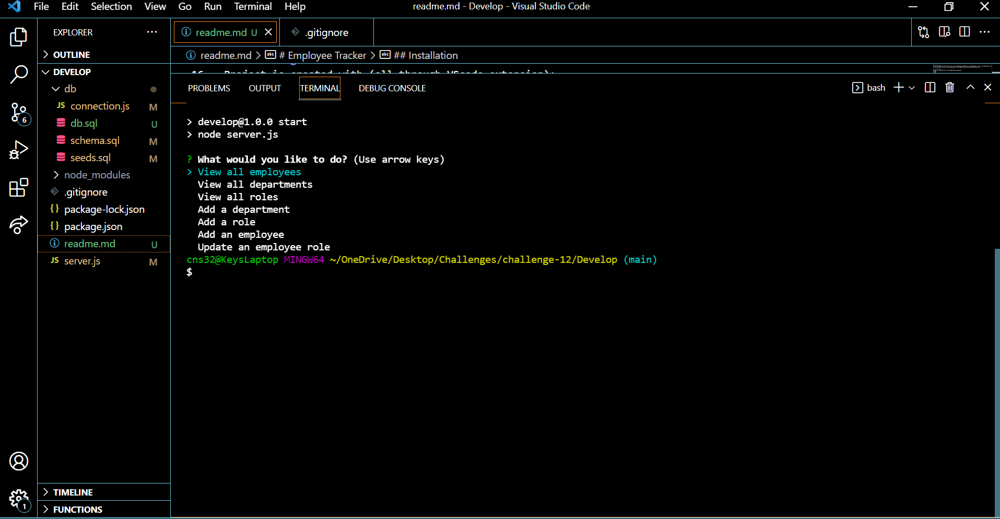

# Employee Tracker 

## Table of contents
* [Employee Tracker Link](https://chiarans.github.io/employee-tracker/)
* [General info](#general-info)
* [Technologies](#technologies)
* [Installation](#installation)
* [Demo](#demo)

## General info
This is an interface that allows you to track employee information. All departments, roles, and employees are saved in the database. You can view an employee or even change their information using their ID.
	
## Technologies
Project is created with (all through VScode extension):
* HTML
* CSS
* JavaScript
* npm inquirer
* Mysql2 package
* console.table package
	
## Installation

Installation is fairly simple. All you have to do is clone the repository and run npm install in the terminal to download all the dependencies. This application requires the additional download and use of the npm inquirer, mysql2, and console.table package. After installing all the dependencies, run 'npm start' in the termianl to run the application.

## Demo
Excuse the technica difficulties with Inquirer in the [Demo](https://watch.screencastify.com/v/Gadh4e0qhBq9wzJ2wCtG)
